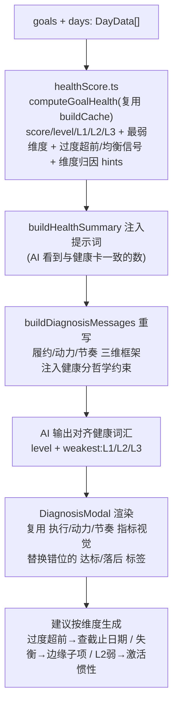

# 设计文档：让 AI 诊断「说健康分的语言」

> 日期：2026-07-16
> 关联计划：`2026-07-16-health-score-diagnosis.md`

## 1. 问题陈述

用户反馈：AI 诊断没有理解「健康分」的设计哲学。

根因（已探查确认）：

- **口径错位**：`DeviationCalculator` 只算 1D「偏差（expectedProgress vs actualProgress）」，是健康分 **L1 按时** 那一小块的代理，完全没碰 **L2（动力/趋势）** 与 **L3（停滞/均衡/过度超前）**。
- **提示词预设「你一定落后/停滞」**：`buildDiagnosisMessages` 的 system 永远让 AI 做「为什么落后」归因，于是 AI 永远诊断不出健康分真正关心的反例（领先但过度超前、进度达标但严重不均衡、落后但动力在加速）。
- **词汇表对不上**：AI 输出 `on_track|behind|stuck|done|at_risk`，健康分用 `excellent|good|warning|risk` + `L1/L2/L3`。弹窗渲染的「达标/落后/停滞」和健康卡上的「优秀/良好/需关注/风险」是两套话。
- **建议语法与哲学相悖**：机械「把子项 dailyMin 从 N 降到 M」，甚至会教一个已过度超前的人「再加大投入」，与健康分「领先≠健康」唱反调。
- **根因**：诊断完全没复用事实上的「健康真相源」`GoalHealthScore`。

## 2. 健康分的设计哲学（须被诊断继承）

三层复合评分，不是单轴「是否按计划」：

- **L1 履约能力 45%**（按时 30% / 适度提前 10% / 周活跃 5%）
- **L2 趋势动力 30%**（进度趋势 20% / 完成趋势 10%）
- **L3 可持续度 25%**（停滞惩罚 / 均衡度 / 过度超前惩罚 / 拖延惩罚）

反直觉价值观（AI 必须接住）：

1. **「领先」≠「健康」**：过度超前（提前 >3 工作日完成）被惩罚（最多扣 50）。
2. **停滞指数级恶化**：`(days/5)^1.5`，非线性。
3. **子项越均衡越健康**：进度标准差越小越好。
4. **归因按「维度」而非「是否落后」**：`_scoreL1` 弱→调节奏；L2 弱→「先完成一个简单子项激活惯性」；L3 失衡→「关注被忽略的边缘子项」；过度超前→「复查截止日期而非加大投入」。

## 3. 解决思路

**让诊断消费同一套健康分模型，并复用其词汇与归因哲学。** 新增 `src/ai/healthScore.ts`（把 `webapp/.../healthScore.js` 的 L1/L2/L3/score/level 100% 移植为纯 TS，复用 `DeviationCalculator.buildCache` 作为缓存真相源），其余模块改造如下：

## 4. 改动范围（模块级）

| 文件 | 改动 |
|------|------|
| `src/ai/healthScore.ts` | **新增**。TS 移植：TUNING、节假日/工作日、`_scoreL1/L2/L3` 全部分项、`computeGoalHealth`、`computeHealthSet`、`generateHealthHints`、`weakestDimension`、信号提取。零 Obsidian 依赖，`today` 可注入。 |
| `src/ai/GoalDiagnoser.ts` | 扩展 `GoalDiagnosis` 类型（`healthScore?/level?/L1?/L2?/L3?/weakest?`）；新增 `buildHealthSummary`；重写 `buildDiagnosisMessages`（三维框架+哲学约束+新 JSON schema）；`parseDiagnosis`/`normalizeGoal` 读取新字段；`diagnose` 用健康分缓存（拉满 60 天窗口）注入提示词。 |
| `src/ai/DiagnosisModal.ts` | 渲染健康等级（优秀/良好/需关注/风险）替代错位的达标/落后/停滞；有健康数据时显示「执行/动力/节奏」三维指标；建议按维度打标签；向后兼容无健康字段。 |
| `src/ai/runDiagnosis.ts` | 拉取窗口由 `recentDays ?? 14` 提升为 `max(recentDays, STAGNATION_WINDOW=60)`，保证 L3 停滞/过度超前判定有足够历史。 |
| 测试 | 新增 `healthScore.test.ts`；扩展 `goalDiagnoser.test.ts`、`diagnosisModal.test.ts`、`runDiagnosis.test.ts`。 |

## 5. 设计原则（YAGNI / DRY）

- 不重复造轮子：健康分缓存直接复用 `DeviationCalculator.buildCache`（同一 `DeviationCache` 形状），`healthScore.ts` 只在缓存之上算分。
- 不改动 `webapp` 侧健康卡（它已正确），只改插件侧诊断链路。
- 向后兼容：旧字段（`status`/`completion`/`evidenceRef`）保留，`DiagnosisModal` 无健康字段时降级到旧渲染。

## 6. 验收标准

1. `healthScore.ts` 与 webapp `GoalHealthScore` 同口径：同一目标在相同数据下分数一致（用定性断言锁定：过度超前 < 按时完成；均衡 < 偏科；停滞惩罚 > 0）。
2. AI 提示词注入每目标 `score/level/L1/L2/L3/weakest` 与维度归因 hints；system 含健康分哲学硬约束。
3. `parseDiagnosis` 能解析并保留新字段；旧字段回退行为不变。
4. `DiagnosisModal` 用「优秀/良好/需关注/风险」+ 三维指标渲染；向后兼容无健康字段。
5. `npm run test`（vitest）全绿；`tsc --noEmit` 无错；`eslint` 无 error。
